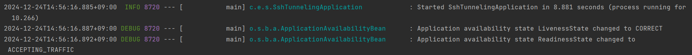

## Open Router

이 프로젝트는 JSch 라이브러리를 사용하여 카카오VM에 배포된 MySQL서버에 SSH Tunneling을 통해 서버 연결한 프로젝트 입니다.


## 주요 기능

- SSH 터널링을 통한 MySQL 서버 연결 구현
- 데이터베이스 서버가 외부에 직접 노출되지 않도록 SSH 터널링을 설정
- 애플리케이션이 로컬 포트 포워딩로 MySQL 서버에 접근


## 디렉토리 구조

```
└─src
    ├─main
    │  ├─java
    │  │  └─com
    │  │      └─example
    │  │          └─sshtunneling
    │  │              │  SshTunnelingApplication.java
    │  │              │
    │  │              └─ssh
    │  │                      SshDataSourceConfig.java
    │  │                      SshTunnelingInitializer.java
    │  │
    │  └─resources
    │      │  application.yml
    │      │
    │      ├─static
    │      └─templates
```


### 디렉토리 설명

- `SshDataSourceConfig.java`: 데이터 소스를 생성하고 반환해주는 클래스 입니다.
- `SshTunnelingInitializer,java`: Spring Boot 애플리케이션에서 SSH 터널링을 설정하기 위한 클래스 입니다.
- `application.yml`: Spring Boot에서의 실행에 필요한 데이터베이스 및 SSH 관련 설정파일 입니다.


## SshDataSourceConfig.java 주요 메서드

### `dataSource(DataSourceProperties properties)`
- **설명:** SSH 터널링을 설정하고 데이터 소스를 생성하는 메서드입니다.
- **파라미터:**
    - `DataSourceProperties`: 데이터베이스 연결 정보를 포함합니다.
- **리턴:** `DataSource` 객체.

---

### `buildSshConnection()`
- **설명:** SSH 연결을 설정하고 전달받은 포트를 반환합니다.
- **위치:** `SshTunnelingInitializer` 클래스에서 구현.


## SshTunnelingInitializer.java 주요 메서드

### `buildSshConnection()`
- **설명:** SSH 세션을 생성하고 데이터베이스 포트를 포워딩합니다.
- **파라미터:** 없음
- **리턴:** `Integer` (포워딩된 포트 번호)
- **동작 흐름:**
  1. **SSH 세션 생성:** `JSch` 라이브러리를 사용하여 SSH 세션을 생성합니다.
  2. **사용자 인증:** `privateKey` 파일을 사용하여 인증합니다.
  3. **포트 포워딩 설정:** 데이터베이스 포트로의 연결을 포워딩합니다.
  4. **포워딩된 포트를 반환:** 설정된 로컬 포트 번호를 반환합니다.

---

### `closeSSH()`
- **설명:** 애플리케이션 종료 시 SSH 세션을 안전하게 닫습니다.
- **파라미터:** 없음
- **리턴:** 없음
- **실행 시점:** `@PreDestroy` 어노테이션을 사용하여 Spring 컨텍스트 종료 시 자동으로 호출됩니다.


## application.yml 설정

### 데이터 소스 설정
- **URL:**  
  SSH 포트 포워딩된 로컬 포트를 사용하여 데이터베이스에 연결합니다. `[forwardedPort]`는 코드에서 동적으로 설정됩니다.

- **사용자 이름 및 비밀번호:**  
  데이터베이스 연결을 위한 인증 정보입니다.

- **HikariCP 설정:**  
  데이터베이스 연결 풀 관련 설정입니다:
  - **최소 연결 수:** 최소한 유지할 유휴 연결 수.
  - **최대 연결 수:** 연결 풀에서 허용하는 최대 연결 수.
  - **연결 유효성 테스트 쿼리:** 연결이 여전히 유효한지 확인하기 위한 쿼리.

---

### SSH 연결 설정
- **원격 호스트:**  
  `remote_jump_host`는 SSH 연결을 위한 서버 주소입니다.

- **SSH 포트:**  
  기본 SSH 포트(`22`)가 사용됩니다.

- **사용자 이름:**  
  SSH 연결에 사용하는 사용자 계정입니다.

- **비공개 키:**  
  SSH 연결을 위한 비공개 키 파일 경로입니다.

- **데이터베이스 포트:**  
  원격 데이터베이스에 연결하기 위한 포트 번호(`3306`)입니다.


### 빌드 및 실행 환경
- JDK 17 이상
- Gradle 7.x 이상

---


